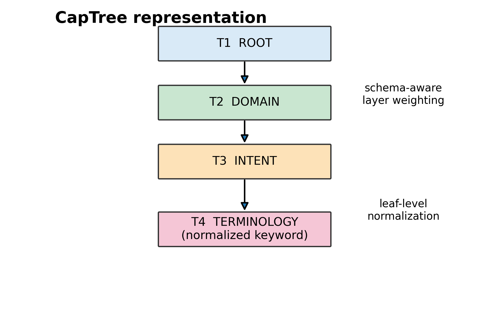
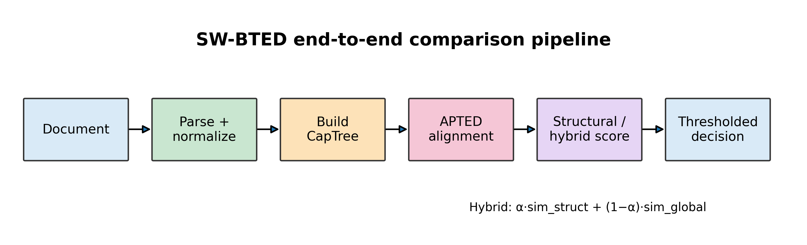
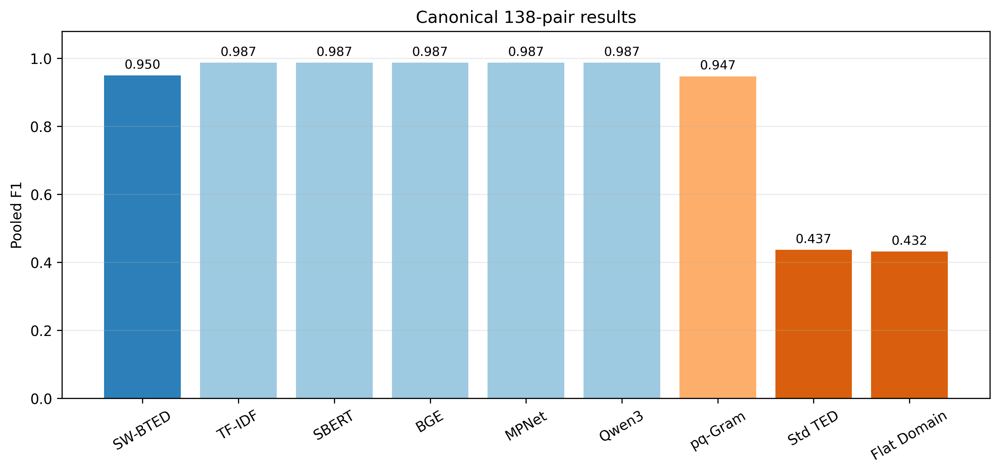
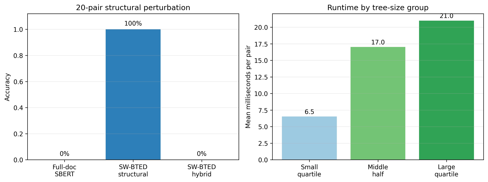
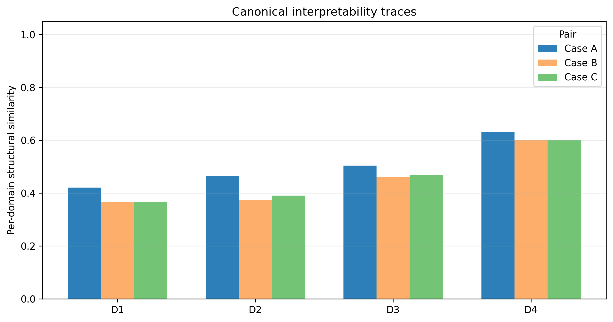

# SW-BTED Project Review Brief

**Purpose:** concise review document for lecturer feedback.  
**Current implementation:** four-layer SW-BTED.  
**Primary evidence:** 138 real-only document pairs.  
**Status:** research-complete, pre-submission.

## 1. Project in one minute

SW-BTED is a schema-weighted bounded tree-edit-distance framework for comparing
structured documents. It converts each document into a four-layer CapTree,
aligns the trees with APTED, and produces a similarity score whose edit trace
can be inspected by a reviewer.

The central claim is deliberately narrow: SW-BTED is not universally more
accurate than modern flat embedding baselines on natural documents. Its main
value is structural sensitivity, inspectable alignment, and controlled
robustness to content placed in the wrong structural domain.

## 2. Abstract

Structured-document similarity systems often compress an entire document into
one embedding, achieving strong aggregate discrimination but losing the ability
to explain which structural components agree or diverge. Tree-edit-distance
methods provide an inspectable alignment, but uniform edit costs can confuse
documents that share a broad topic while differing in functional content.

SW-BTED addresses this gap with a four-layer representation—Root, Domain,
Intent, and Terminology—and schema-weighted edit costs. The method combines
content and schema distance at each layer and uses exact APTED alignment. On a
138-pair real-only capstone benchmark, structural-only SW-BTED obtains F1
`0.9498 ± 0.0253`, reaching statistical parity with strong flat baselines. On
a controlled 20-pair section-reordering benchmark, it achieves 100% accuracy
where full-document SBERT achieves 0%. The result supports structural
sensitivity and interpretability as the method's principal contributions,
rather than universal accuracy superiority.

## 3. Problem and motivation

### Problem

Existing approaches face a tradeoff:

- Full-document embeddings provide strong scalar similarity but cannot explain
  which section or requirement caused the score.
- Uniform tree-edit distance exposes structure but can overvalue superficial
  structural overlap.
- Section-level averaging can retain sections while ignoring their functional
  roles.

For structured requirements documents, moving technically important content
into the wrong functional domain should be detectable even when the vocabulary
is unchanged.

### Research question

Can schema-aware tree alignment provide an inspectable and structurally
sensitive similarity signal while retaining competitive classification quality
on real documents?

## 4. Proposed solution

### Four-layer CapTree

**Figure 1.** Root → Domain → Intent → Terminology representation.

- **T1 Root:** document identity.
- **T2 Domain:** functionally grounded domain sections.
- **T3 Intent:** atomic content units or intents.
- **T4 Terminology:** normalized keyword leaves.

### Schema-weighted cost

At each layer, substitution combines content distance and schema distance:

`cost = (deletion + insertion) × [β × content_distance + (1 − β) × schema_distance]`

The convex combination preserves the metric argument when both component
distances satisfy the metric assumptions. APTED then computes the exact tree
alignment under the resulting costs.

### Two operating modes

- **Structural-only:** prioritizes schema compliance and structural attribution.
- **Hybrid:** combines structural similarity with full-document embedding
  cosine similarity using `α·sim_struct + (1−α)·sim_global`.

## 5. End-to-end pipeline

**Figure 2.** Document parsing and normalization → CapTree construction → APTED
alignment → structural/hybrid score → thresholded decision.

The pipeline is intentionally modular: parsing and taxonomy construction are
separate from alignment, and the edit mapping can be inspected after scoring.

## 6. Evaluation design

| Component | Protocol |
|---|---|
| Primary dataset | 138 real-only pairs; 38 positive and 100 negative |
| Representation | Four-layer Root/Domain/Intent/Terminology trees |
| Cross-validation | 5-fold stratified split, seed 42 |
| Threshold selection | `0.005` grid, training fold only |
| Strong baselines | SBERT, BGE-small, MPNet, Qwen3, TF-IDF, pq-Gram |
| Controlled diagnostic | 20 same-text pairs with D2↔D3 section swap |
| Statistics | Paired exact McNemar tests with Holm correction |

The 20-pair perturbation set is a diagnostic benchmark with constructed labels;
it is not presented as a replacement for real-world evaluation.

## 7. Main results

**Figure 3.** Pooled F1 on the canonical 138-pair evaluation.

| Method | F1 | Interpretation vs. SW-BTED |
|---|---:|---|
| **SW-BTED structural-only** | **0.950** | Reference |
| TF-IDF | 0.987 | Statistical parity |
| SBERT MiniLM | 0.987 | Statistical parity |
| BGE-small | 0.987 | Statistical parity |
| MPNet | 0.987 | Statistical parity |
| Qwen3-Embedding-4B | 0.987 pooled OOF | Statistical parity |
| pq-Gram | 0.9479 ± 0.0478 | Statistical parity |
| Section Cosine | 0.684 | SW-BTED significantly better |
| Standard TED | 0.437 | SW-BTED significantly better |
| Genuine Flat Domain SBERT | 0.432 | SW-BTED significantly better |

**Protocol note.** TF-IDF `0.9867` and Section Cosine `0.6837` are from the
clean canonical 138-pair suite. Older archived harnesses reported different
values under a different input/scope configuration; those values are not
mixed into this review brief. Qwen3 was re-run with the same 0.005 train-fold
threshold grid and remains `0.9867 ± 0.0267` mean-fold F1 (`0.9870` pooled).

### Controlled structural perturbation

**Figure 5.** Left: controlled D2↔D3 perturbation accuracy. Right: mean
SW-BTED alignment time by tree-size group.

- SW-BTED structural-only: 100% accuracy, 0/20 false positives.
- Full-document SBERT: 0% accuracy, 20/20 false positives.
- Hybrid: 0% accuracy because unchanged full-document text remains maximally
  similar.
- Exact paired test: McNemar `p = 1.9073 × 10⁻⁶`.

### Runtime

On the canonical 138 pairs, structural alignment and scoring took 2.1312 s in
total: mean 15.44 ms/pair, median 17.94 ms/pair, and P95 23.52 ms/pair. These
figures exclude parsing, model loading, and embedding inference.

### Document-disjoint robustness audit

To test whether repeated document identities across pair rows drive the primary
result, a supplemental `GroupKFold(5)` audit grouped pairs by connected
components of the document-pair graph. This produced 43 document components
covering 178 documents, with no component appearing in both train and test.
SW-BTED obtained pooled F1 `0.9157` (38 TP, 7 FP, 93 TN, 0 FN). This is lower
than the primary pair-level F1 `0.9500`, as expected for the more conservative
split, but it remains a separate robustness result rather than a replacement
for the frozen primary protocol. Full details are in
`reports/DOCUMENT_DISJOINT_ROBUSTNESS_138.md`.

### Beta-weight ablation

Using the frozen `0.005` threshold protocol, the documented schedule
(`T2=0.0, T3=0.9, T4=0.8`) reaches F1 `0.9498 ± 0.0253`. Uniform and
schema-heavy schedules fall to approximately `0.4339`, while the tested
content-heavy schedule remains at `0.9498`. This supports the importance of
the T3 content term, but should be interpreted as an ablation on this dataset,
not as a universal optimum. Details are in
`reports/ABLATION_138_CLEAN_005_REPORT.md`.

### Interpretability

**Figure 4.** Per-domain structural similarity for three canonical cases:

- Case A: `SU26SE102–SU26SE102_plag`, positive plagiarism pair.
- Case B: `SP26SE068–SU26SE063`, SBERT false positive corrected by SW-BTED.
- Case C: `SP26SE122–SP26SE055`, negative Type_C pair classified correctly by
  both methods.

The raw APTED mappings and representative replacements are available in
`reports/interpretability/CANONICAL_INTERPRETABILITY_TRACE_3.md`.

## 8. What the results support

The evidence supports three claims:

1. SW-BTED provides an inspectable structural comparison mechanism.
2. It is sensitive to the tested D2↔D3 structural perturbation where flat
   full-document similarity is position-invariant.
3. On natural documents, it is competitive with strong baselines and clearly
   better than the tested unweighted or flat-domain structural variants.

The evidence does **not** support a claim that SW-BTED has the highest overall
F1 among all baselines on the 138-pair natural-document benchmark.

## 9. Limitations and threats to validity

- The primary dataset is modest and comes from one capstone-document setting.
- The perturbation benchmark has 20 constructed negative examples and no
  naturally occurring positive perturbations.
- A domain taxonomy must be grounded for each new genre.
- Cross-domain transfer to bug reports required manual diagnosis and parameter
  adaptation.
- Qwen3 is reported as pooled out-of-fold evidence, not as a five-fold mean.
- Runtime excludes embedding inference and should not be interpreted as
  end-to-end service latency.
- A third genre has not yet been evaluated.

## 10. Questions for lecturer review

1. Is the structural sensitivity and interpretability contribution sufficiently
   distinct from existing structure-aware embedding methods?
2. Is the controlled perturbation benchmark convincing as a diagnostic, or
   should it be expanded with cross-document and positive constructions?
3. Is the current four-layer taxonomy adequately justified and reproducible?
4. Should the paper emphasize structural attribution more strongly than F1?
5. Is a third domain necessary before submission to the intended venue?
6. Are the metric-preservation assumptions and proof sketch rigorous enough?

## 11. Reproducibility entry points

- Canonical metrics: `reports/FINAL_CANONICAL_RESULTS_138.md`
- Clean baseline suite: `reports/CLEAN_BASELINE_SUITE_138.md`
- Qwen3 audit: `reports/QWEN3_PREDICTION_AUDIT_REPORT.md`
- Perturbation rerun: `reports/STRUCTURAL_PERTURBATION_REPRODUCTION_20.md`
- Runtime report: `reports/RUNTIME_BENCHMARK_CANONICAL_138.md`
- Interpretability trace: `reports/interpretability/CANONICAL_INTERPRETABILITY_TRACE_3.md`
- Source manifest: `submission_neutral/README.md`

## Current review status

The project is ready for substantive lecturer review. It is not yet the final
journal-submission package because a public repository/dataset link and the
target journal format are still pending.
